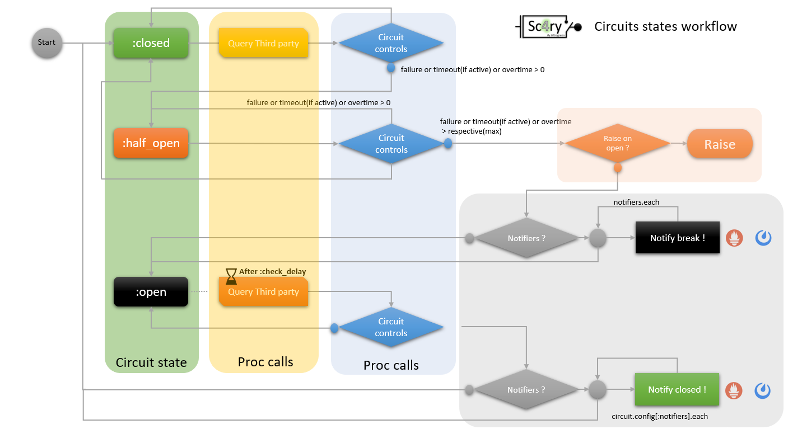

# Sc4ry : Simple CircuitBreacker For RubY

Sc4ry provide the Circuit Breaker Design Pattern for your applications

[](https://github.com/Ultragreen/sc4ry/actions?query=workflow%3ARuby+branch%3Amaster)


[](https://rubydoc.info/gems/sc4ry)


[](https://badge.fury.io/rb/sc4ry)


 
_Simple CircuitBreacker 4 RubY_

## Installation

Add this line to your application's Gemfile:

```ruby
gem 'sc4ry'
```

And then execute:

    $ bundle install

Or install it yourself as:

    $ gem install sc4ry

## Usage

### Circuits States Worflow

 
### sample with Restclient

```ruby

require 'rubygems'
require 'sc4ry'


puts 'Initial default config'
pp Sc4ry::Circuits.default_config


Sc4ry::Circuits.merge_default_config diff: {timeout: true }
# or with a block
Sc4ry::Circuits.configure do |spec|
  spec.max_time = 12
end


# display default config
puts 'Default config'
pp Sc4ry::Circuits.default_config


# defining a circuit, config must be empty or override from default
Sc4ry::Circuits.register circuit: :test, config: {:notifiers => [:prometheus,:mattermost], :exceptions => [Errno::ECONNREFUSED, URI::InvalidURIError] }
# or with a block
Sc4ry::Circuits.register circuit: :test2 do |spec|
  spec.exceptions = [Errno::ECONNREFUSED]
end
# or 
Sc4ry::Circuits.register circuit: :test3


puts "Circuits list"
pp Sc4ry::Circuits::list

# Config an alternate logger
Sc4ry::Logger.register name: :perso, instance: ::Logger.new('/tmp/logfile.log')
Sc4ry::Logger::current = :stdout


# default values, circuit is half open before one of the max count is reached

# DEFAULT_CONFIG = { 
#             :max_failure_count => 5,
#             :timeout_value => 20,
#             :timeout => false,
#             :max_timeout_count => 5,
#             :max_time => 10,
#             :max_overtime_count => 3,
#             :check_delay => 30,
#             :notifiers => [],
#             :forward_unknown_exceptions => true,
#             :raise_on_opening => false,
#             :exceptions => [StandardError, RuntimeError]
#             }

# display configuration for a specific circuit
Sc4ry::Circuits::list.each do |circuit|
  puts "Config #{circuit} :"
  pp Sc4ry::Circuits.get circuit: circuit
end

 # sample Mattermost notification
#Sc4ry::Notifiers::config({:name => :mattermost, :config =>  {:url => 'https://mattermost.mycorp.com', :token => "<TOKEN>"}})

# sample loop
100.times do
  sleep 1
  Sc4ry::Circuits.run circuit: :test do 
   # for the test choose or build an endpoint you must shutdown  
   puts RestClient.get('http://<URL_OF_AN_ENDPOINT>')
  end
end

```

## Development

After checking out the repo, run `bin/setup` to install dependencies. Then, run `rake spec` to run the tests. You can also run `bin/console` for an interactive prompt that will allow you to experiment.

To install this gem onto your local machine, run `bundle exec rake install`. To release a new version, update the version number in `version.rb`, and then run `bundle exec rake release`, which will create a git tag for the version, push git commits and tags, and push the `.gem` file to [rubygems.org](https://rubygems.org).

## Contributing

Bug reports and pull requests are welcome on GitHub at https://github.com/Ultragreen/sc4ry. 

## License

The gem is available as open source under the terms of the [MIT License](https://opensource.org/licenses/MIT).

