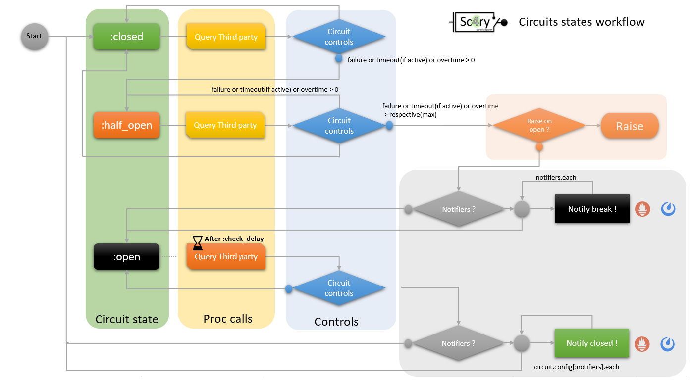

# Sc4ry : Simple CircuitBreacker For RubY

Sc4ry provide the Circuit Breaker Design Pattern for your applications

[](https://github.com/Ultragreen/sc4ry/actions?query=workflow%3ARuby+branch%3Amaster)


[](https://rubydoc.info/gems/sc4ry)


[](https://badge.fury.io/rb/sc4ry)


<noscript><a href="https://liberapay.com/ruydiaz/donate"></a></noscript>

 
_Simple CircuitBreacker 4 RubY_

## Installation

Add this line to your application's Gemfile:

```ruby
gem 'sc4ry'
```

And then execute:

    $ bundle install

Or install it yourself as:

    $ gem install sc4ry

## Usage

### Circuits States Worflow

 
### Quickstart : sample with Restclient

A quick circuit test :
create a test script lile test.rb :

### the Sc4ry Config default values :

default values, circuit is half open before one of the max count is reached

* :max_failure_count
* * description : maximum failure before opening circuit
* * default value : 5
*  :timeout_value=>20,                         => timeout value, if :timeout => true
*  :timeout=>false,                            => (de)activate internal timeout
*  :max_timeout_count=>5,                      => maximum timeout try before opening circuit
*  :max_time=>10,                              => maximum time for a circuit run
*  :max_overtime_count=>3,                     => maximum count of overtime before opening circuit
*  :check_delay=>30,                           => delay after opening, before trying again to closed circuit or after an other check
*  :notifiers=>[],                             => active notifier, must be :symbol in [:prometheus, :mattermost]
*  :forward_unknown_exceptions => true,        => (de)activate forwarding of unknown exceptions, just log in DEBUG if false
*  :raise_on_opening => false,                 => (de)activate raise specific Sc4ry exceptions ( CircuitBreaked ) if circuit opening
#  :exceptions=>[StandardError, RuntimeError]} => list of selected Exceptions considered for failure, others are SKIPPED.

### Global overview for all features

This script could be usefull to test all feature on your installation 

You need: 
* Redis 
* Prometheus pushgateway
* an endpoint if you want to check real endpoint
* a Mattermost/Slack incoming webhook (optional)

You could gate all this pre-requistes simply if you jave docker up on your machine

```
    $ docker pull redis:latest
    $ docker run --rm -d  -p 6379:6379/tcp redis:latest
    $ docker pull prom/pushgateway:latest
    $ docker run --rm -d -p 9091:9091 prom/pushgateway:latest
    $ git clone https://github.com/Ultragreen/MockWS.git
    $ cd MockWS
    $ rackup
```

create the test script like :

```ruby

    require 'rubygems'
    require 'sc4ry'


    include Sc4ry

    # display of default Sc4ry config
    puts '1.1/ CONFIG : Initial default config'
    Circuits.default_config.each do |item,value|
      puts " * #{item} : #{value}"
    end
    puts ''

    # testing the two ways to configure Sc4ry default config
    puts "1.2/ CONFIG : modifying default config activate timout and set max_time to 12"
    Circuits.merge_default_config diff: {timeout: true }
    Circuits.configure do |spec|
      spec.max_time = 12
    end
    puts ''

    # display default config, must be override with a nested hash by calling default_config= method
    puts '1.3/ CONFIG : Default config updated:'
    Circuits.default_config.each do |item,value|
      puts " * #{item} : #{value}"
    end
    puts ''

    # display current data Store
    print "2.1/ STORE : Current datastore backend : "
    puts Circuits.store.current
    puts ''


    # display available backend
    puts "2.2/ STORE : List of existing backends : "
    Circuits.store.list_backend.each do |backend|
      puts " - #{backend}"
    end
    puts ''


    # display Redis backend config in store before change
    puts '2.3/ STORE : display default config of redis backend'
    Circuits.store.get_config(backend: :redis).each do |item,value|
      puts " * #{item} : #{value}"
    end
    puts ''

    # reconfigure a backend
    puts "2.4/ STORE : reconfigure Redis backend"
    Circuits.store.config_backend name: :redis, config: {:host => 'localhost', :port => 6379, :db => 10 }
    puts

    # display after
    puts '2.5/ STORE : display altered config of redis backend'
    Circuits.store.get_config(backend: :redis).each do |item,value|
      puts " * #{item} : #{value}"
    end
    puts ''


    # change backend

    puts '2.6/ STORE : change to redis backend (NEED a Redis installed) '
    puts "  $ docker pull redis:latest"
    puts "  $ docker run --rm -d  -p 6379:6379/tcp redis:latest"
    Circuits.store.change_backend name: :redis
    puts ''

    puts '2.7/ STORE : flush redis backend, just for test, and for idempotency (NEED a Redis installed) '
    Circuits.store.flush
    puts ''

    # defining a circuit, config must be empty or override from default
    puts "3.1/ CIRCUIT : registering a circuit by merge :"
    Circuits.register circuit: :test, config: {:notifiers => [:prometheus,:mattermost], :exceptions => [Errno::ECONNREFUSED, URI::InvalidURIError] }
    puts ""

    puts "3.2/ CIRCUIT : registering a circuit by block :"
    Circuits.register circuit: :test2 do |spec|
      spec.exceptions = [Errno::ECONNREFUSED]
    end
    puts ''

    puts "3.3/ CIRCUIT : registering a circuit by default :"
    Circuits.register circuit: :test3
    puts ''

    puts "3.4/ CIRCUITS : Circuits list"
    Circuits::list.each do |circuit|
      puts " * #{circuit}"
    end
    puts ""

    puts "3.5/ CIRCUIT : display a circuit config :test3 :"
    Circuits.get(circuit: :test3).each do |item,value|
      puts " * #{item} : #{value}"
    end
    puts ""

    puts "3.6/ CIRCUIT : update config of :test3 => :raise_on_opening == true  :"
    Circuits.update_config circuit: :test3, config: {raise_on_opening: true}
    puts ''

    puts "3.7/ CIRCUIT : display a circuit config :test3 after change :"
    Circuits.get(circuit: :test3).each do |item,value|
      puts " * #{item} : #{value}"
    end
    puts ""


    puts "3.8/ unregister a circuit : :test2 :"
    Circuits.unregister circuit: :test2
    puts ''

    puts "3.9/ CIRCUITS : Circuits list after unregister"
    Circuits::list.each do |circuit|
      puts " * #{circuit}"
    end
    puts ""

    # Config an alternate logger

    puts "4.1/ LOGGER : register a logger on file "
    Circuits.loggers.register name: :perso, instance: ::Logger.new('/tmp/logfile.log')
    puts ''

    puts "4.2/ LOGGER : get the list of available loggers"
    Circuits.loggers.list_available.each do |logger|
      puts " * #{logger}"
    end
    puts ''

    puts "4.3/ LOGGER : change logger to :perso"
    Circuits.loggers.current = :perso
    puts ""


    # sample Mattermost notification
    puts "5/ set notifier mattermost on dummy url, change with your slack or mattermost server"
    Sc4ry::Notifiers::config name: :mattermost, config: {:url => 'https://mattermost.mycorp.com', :token => "<TOKEN>"}
    puts ""


    # sample loop
    puts "6/ running circuits test, please wait ... (see /tmp/logfile.log for result)"
    puts " check endoint status for different result, you cloud use http://github.com/Ultragreen/MockWS for testing endpoint, on an other tty"
    puts "  $ git clone https://github.com/Ultragreen/MockWS.git"
    puts "  $ cd MockWS"
    puts "  $ rackup"
    begin
      10.times do
        sleep 1
        Circuits.run circuit: :test do
          # for the test choose or build an endpoint you must shutdown
          puts RestClient.get('http://localhost:9292/test2/data')
        end
      end
    rescue Interrupt
      puts 'Interrputed'
    ensure
      Circuits.store.flush
    end

    puts "end"
```

## Development

After checking out the repo, run `bin/setup` to install dependencies. Then, run `rake spec` to run the tests. You can also run `bin/console` for an interactive prompt that will allow you to experiment.

To install this gem onto your local machine, run `bundle exec rake install`. To release a new version, update the version number in `version.rb`, and then run `bundle exec rake release`, which will create a git tag for the version, push git commits and tags, and push the `.gem` file to [rubygems.org](https://rubygems.org).

## Contributing

Bug reports and pull requests are welcome on GitHub at https://github.com/Ultragreen/sc4ry. 

## License

The gem is available as open source under the terms of the [MIT License](https://opensource.org/licenses/MIT).

